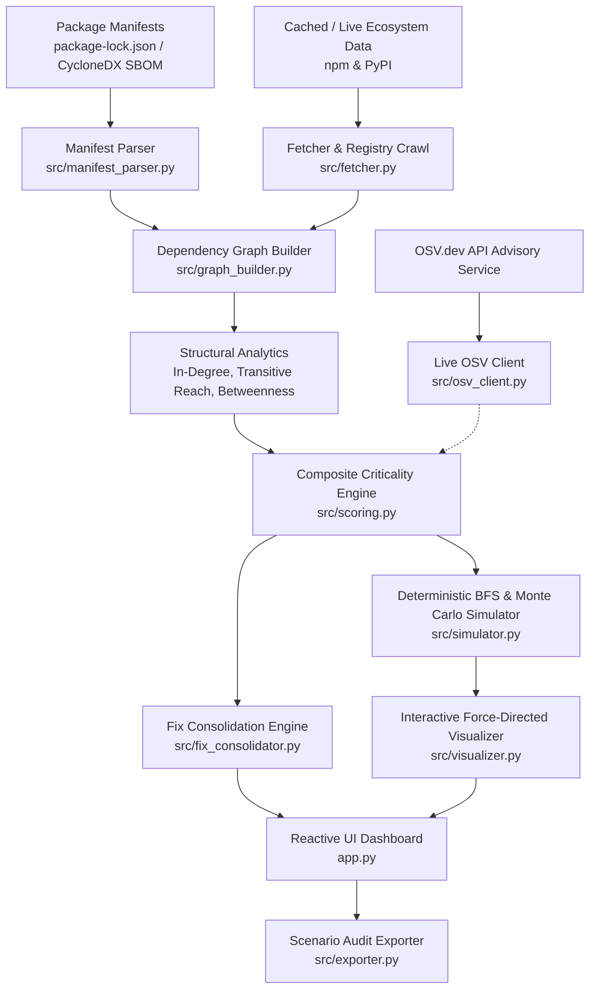

# 🛡️ RippleGuard: Explainable Supply-Chain Risk Intelligence & Blast-Radius Simulator

> **UN SDG 9 Track:** Industry, Innovation & Infrastructure • Software Supply Chain Resilience  
> **Mission:** Transform opaque open-source software supply chains into transparent, explainable, and resilient digital infrastructure by identifying foundational dependencies where modest vulnerabilities structurally amplify into catastrophic downstream blast radii.

---

## 🚀 Overview

Standard Software Composition Analysis (SCA) tools alert developers to vulnerabilities based purely on isolated CVSS scores. This approach creates severe alert fatigue (over 85% of automated PRs go unmerged) and fails to answer the most critical operational question: **"If this package is poisoned, how far does the blast radius reach?"**

**RippleGuard** models software ecosystems as directed dependency graphs to compute structural reachability, betweenness bridge bottlenecks, multi-origin compromise propagation, Monte Carlo probabilistic infection likelihoods, and cost-effective fix consolidation sequences.

---

## 🏛️ System Architecture



### Module Breakdown

| Module | Purpose & Core Capabilities |
| :--- | :--- |
| [`app.py`](file:///c:/Users/samri/Documents/antigravity/eager-pascal/app.py) | Full-featured Streamlit UI dashboard with force-directed graph visualizer, simulation toggles, weight sliders, risk dossiers, and fix consolidation panels. |
| [`src/graph_builder.py`](file:///c:/Users/samri/Documents/antigravity/eager-pascal/src/graph_builder.py) | Directed graph ($G$) construction, in-degree calculation, topological transitive reachability DP ($O(V+E)$), and size-gated betweenness centrality ($O(V \cdot E)$). |
| [`src/simulator.py`](file:///c:/Users/samri/Documents/antigravity/eager-pascal/src/simulator.py) | **Deterministic BFS** (`simulate_multi_compromise`) and **Monte Carlo probabilistic propagation** (`simulate_monte_carlo`) deriving stochastic likelihood from version pin constraints. |
| [`src/fix_consolidator.py`](file:///c:/Users/samri/Documents/antigravity/eager-pascal/src/fix_consolidator.py) | Greedy set-cover engine turning isolated alerts into prioritized remediation sequences; supports dual-ranking (**Efficiency ROI** vs. **Pure Coverage**). |
| [`src/scoring.py`](file:///c:/Users/samri/Documents/antigravity/eager-pascal/src/scoring.py) | 4-dimension composite criticality scoring with customizable weights, automated risk tiering, and template-based explainable reasoning. |
| [`src/osv_client.py`](file:///c:/Users/samri/Documents/antigravity/eager-pascal/src/osv_client.py) | Live OSV.dev vulnerability query client with CVSS v3 vector extraction and in-memory TTL caching. |
| [`src/manifest_parser.py`](file:///c:/Users/samri/Documents/antigravity/eager-pascal/src/manifest_parser.py) | Auto-detecting manifest ingestion engine for npm `package-lock.json` (v1 and v3) and CycloneDX 1.4/1.5 JSON SBOMs. |
| [`src/fetcher.py`](file:///c:/Users/samri/Documents/antigravity/eager-pascal/src/fetcher.py) | Offline snapshot loaders for npm and PyPI ecosystems, crawl utilities, and PEP 508 requirement parsers. |
| [`src/visualizer.py`](file:///c:/Users/samri/Documents/antigravity/eager-pascal/src/visualizer.py) | Pyvis force-directed graph generator styled in Peacock Green & Lavender, featuring opacity-shaded Monte Carlo probabilities. |
| [`src/exporter.py`](file:///c:/Users/samri/Documents/antigravity/eager-pascal/src/exporter.py) | Generates standalone Markdown audit reports summarizing active graph scenarios, risk factors, attack paths, and remediation priorities. |
| [`src/models.py`](file:///c:/Users/samri/Documents/antigravity/eager-pascal/src/models.py) | Strongly-typed dataclasses implementing `DictCompatible` for seamless attribute and subscript access. |

---

## 🎯 Tracked Functional & Non-Functional Requirements Matrix

| ID | Feature Description | Status & Implementation |
| :---: | :--- | :---: |
| **FR-1.1** | **Custom Manifest Upload** | ✅ Ingests `package-lock.json` (v1 & v3) and `CycloneDX` JSON SBOMs directly via UI or API. |
| **FR-1.2** | **Multi-Ecosystem Support** | ✅ Dual-ecosystem support for **npm** (64 nodes) and **PyPI** (35 nodes) with ecosystem switcher. |
| **FR-1.3** | **Live OSV.dev Integration** | ✅ Sidebar toggle to fetch real-time vulnerability advisories with graceful offline fallback. |
| **FR-1.4** | **Rich Package Metadata** | ✅ Parses licenses, publish timestamps, maintainers, and download metrics. |
| **FR-2.3** | **Configurable Crawl Depth** | ✅ Configurable registry exploration depth with offline cache persistence. |
| **FR-3.1** | **Betweenness Centrality** | ✅ Optional shortest-path bottleneck signal with size-gating threshold ($V \le 500$ live). |
| **FR-4.3** | **Multi-Origin Compromise** | ✅ Multi-package origin simulation identifying overlapping blast radii and minimum-hop distances. |
| **FR-4.4** | **Monte Carlo Propagation** | ✅ $N$-trial stochastic sampler deriving edge probabilities from semver pin constraints. |
| **FR-5.2** | **Cost/Impact Mitigation** | ✅ 2D remediation ranking combining marginal risk coverage with an effort taxonomy (Low to Very High). |
| **FR-5.4** | **Raw Reasoning Drill-Down** | ✅ Expandable mathematical breakdown displaying active weights, normalized subscores, and formulas. |
| **FR-5.5** | **Confidence Proxy** | ✅ Explicit data provenance badges (`Curated`, `Live OSV.dev`, `Default Baseline`). |
| **FR-6.5** | **Markdown Report Export** | ✅ Downloadable audit report capturing active simulation mode, multi-origin paths, and dual fix rankings. |
| **NFR-2** | **Sub-Second Performance** | ✅ Full offline analytical pipeline executes in $<50\text{ ms}$; $N=1000$ Monte Carlo executes in $\sim 12\text{ ms}$. |

---

## 🔬 Core Analytical Capabilities

### 1. Composite Criticality Scoring (FR-3.1 / FR-3.3)
Composite criticality combines base vulnerability severity with graph-theoretic topology:

$$\text{Structural Subscore} = w_{\text{trans}} \cdot \left(\frac{R_i}{R_{\max}}\right) + w_{\text{indeg}} \cdot \left(\frac{D_i}{D_{\max}}\right) + w_{\text{between}} \cdot \left(\frac{B_i}{B_{\max}}\right)$$

$$\text{Vulnerability Subscore} = w_{\text{cvss}} \cdot \left(\frac{\text{CVSS}_i}{10}\right)$$

$$\text{Criticality Score} = 100 \cdot (\text{Structural Subscore} + \text{Vulnerability Subscore})$$

- Default configuration: $w_{\text{cvss}} = 0.35$, $w_{\text{trans}} = 0.40$, $w_{\text{indeg}} = 0.25$, $w_{\text{between}} = 0.00$.
- **Betweenness Gate:** Computed live for graphs with $\le 500$ nodes; automatically skipped on larger graphs to avoid $O(V \cdot E)$ UI lag.

### 2. Monte Carlo Probabilistic Propagation (FR-4.4)
Deterministic BFS treats compromise propagation as binary. In reality, propagation depends on package update policies and version constraints. RippleGuard derives edge probabilities from manifest pin status:
- **Exact Pinned Version** (`==x.y.z`, `1.9.1`): `0.20` likelihood
- **Tilde Range** (`~x.y.z`, patch only): `0.65` likelihood
- **Caret Range** (`^x.y.z`, minor/patch updates): `0.85` likelihood
- **Loose Major Range** (`^4`, `*`, `>=`): `0.90` likelihood
- **Disclosed Heuristic Default**: `0.70` estimate where pin status is unspecified

*Audited Performance:* $N=1000$ trials completes in **$12.76\text{ ms}$** on the 64-node npm graph, revealing that packages like `morgan` have only an **$19.6\%$** real propagation likelihood despite BFS labeling them as affected.

### 3. Fix Consolidation ("Fix This First") & 2D ROI Ranking (FR-5.2)
Solves alert fatigue by finding the minimum subset of package updates that eliminates the maximum overlapping downstream blast radius across flagged alerts using a greedy set-cover algorithm:
- **Coverage View:** Ranks by raw marginal percentage coverage of total flagged risk.
- **Efficiency View:** Ranks by Return on Investment ($\text{ROI} = \frac{\text{Marginal Coverage \%}}{\text{Effort Cost}}$).
- **Effort Taxonomy:**
  - *Low Effort (Cost 1.0):* Pin to exact version / lockfile digest, add monitoring/alerting.
  - *Low-Medium Effort (Cost 1.5):* Upgrade to patched minor version.
  - *Medium Effort (Cost 2.0):* Isolate/sandbox dependency, resilience tests.
  - *High Effort (Cost 3.0):* Major version upgrade (breaking changes), replace dependency entirely.
  - *Very High Effort (Cost 4.0):* Fork and vendor audit.

---

## 🎬 Demo Walkthrough Script

### Step 1: Foundational Amplification (`debug`)
1. Select **`debug`** in the sidebar dropdown.
2. Note that base CVSS is a modest **5.3 / 10.0**, but RippleGuard scores it as **CRITICAL RISK (79.5 / 100)**.
3. Observe the explanation: `debug` touches 7 direct dependents and cascades into 9 transitive components, threatening 3 top-level application seeds (`axios`, `express`, `morgan`).
4. Click **`🚨 Simulate`** to illuminate the attack tree in vibrant lavender.

### Step 2: Cross-Ecosystem Entanglement (`mime-types`)
1. Select **`mime-types`**.
2. Base CVSS is only **2.5 / 10.0**, yet it is flagged as **HIGH RISK (58.6 / 100)**.
3. Click **`🚨 Simulate`**: observe that `mime-types` bridges server-side Express (`mime-types ➔ express`) and client-side Axios (`mime-types ➔ form-data ➔ axios`).

### Step 3: Multi-Origin Blast Overlap (`debug` + `mime-types`)
1. In the sidebar multi-select, select both **`debug`** and **`mime-types`**.
2. Click **`🚨 Simulate`**.
3. Point to the **Golden Amber** nodes: 5 packages (`axios`, `body-parser`, `express`, `send`, `serve-static`) are reachable from both origins simultaneously, resulting in a 14-node union blast radius.

### Step 4: Monte Carlo Probabilistic Reality Check (The `morgan` Insight)
1. In the sidebar, toggle **Propagation Mode** from *"Deterministic (worst-case)"* to *"Monte Carlo (probability-weighted)"*.
2. Click **`🚨 Simulate`**.
3. Inspect the **Monte Carlo Infection Probability** panel:
   - While BFS reports 14 packages as affected, Monte Carlo reveals that **9 packages have $<95\%$ infection likelihood**.
   - **Key Demo Highlight:** Point out **`morgan`**: deterministic BFS claims it is compromised, but Monte Carlo reveals its infection likelihood is only **~19.6%** ($\pm 0.0126$) because it requires traversing chained, minor-pinned dependencies!

### Step 5: Fix Consolidation ("Fix This First")
1. Scroll to the **🎯 Fix This First** panel.
2. Under **Coverage View**, the greedy set-cover sequence is:
   1. `#1 ms` (61.1% coverage)
   2. `#2 mime-types` (83.3% cumulative)
   3. `#3 depd` (94.4% cumulative)
   4. `#4 on-finished` (100.0% cumulative)
3. Toggle to **Rank by efficiency (coverage per effort)**:
   - Notice that **`on-finished` (Low Effort • ROI 5.6)** jumps ahead of **`depd` (High Effort • ROI 3.7)** into Rank #3!
   - This gives engineering teams immediate prioritization of quick wins over expensive rewrites.

### Step 6: Zero-Downstream Containment (`dotenv`)
1. Select **`dotenv`** and click **`🚨 Simulate`**.
2. Point out the **Zero-Downstream Root Application** banner: RippleGuard correctly identifies that `dotenv` is a leaf application seed with 0 downstream dependents, preventing false alarms.

### Step 7: Export Scenario Audit Report
1. Click **`📄 Export Report (Markdown)`**.
2. Open the downloaded file to inspect the complete audit trail, data source disclosures, shortest attack paths, Monte Carlo probabilities, and two-dimensional remediation comparison table.

---

## 🧪 Testing & Verification

Run the full regression test suite:

```bash
pytest tests/ -v
```

### Verified Test Suite Breakdown (47 Tests, 100% Passing):
- `tests/test_export.py` (4 tests): Baseline report, active simulation, containment status, PyPI ecosystem.
- `tests/test_fetcher.py` (2 tests): Real package metadata, configurable crawl depth.
- `tests/test_fix_consolidator.py` (7 tests): Greedy set cover, cost/impact ROI reordering, synthetic validation, effort fallback, taxonomy lookup, action derivation, coverage invariants.
- `tests/test_graph_builder.py` (6 tests): NetworkX betweenness parity, score invariants, threshold gating ($>500$), structural bottlenecks, weighting normalization.
- `tests/test_manifest_parser.py` (6 tests): package-lock.json (v1/v3), CycloneDX JSON, auto-detection, malformed error handling, end-to-end pipeline.
- `tests/test_models.py` (1 test): Dataclass instantiation & dict compatibility.
- `tests/test_osv_client.py` (8 tests): CVSS v3 parsing, qualitative fallbacks, mock success/empty/error queries, scoring fallback vs live data.
- `tests/test_pypi_fetcher.py` (4 tests): PEP 508 requirement parsing, metadata mocking, offline cache loading, downstream analytics.
- `tests/test_simulator.py` (9 tests): Deterministic BFS parity, multi-origin overlap, edge cases, pinned near-zero MC, unpinned BFS convergence, seed reproducibility, mixed variance, empty origin handling.

---

## ⚖️ Transparency & Disclosures

1. **Topological Signals:** All graph metrics (in-degree, transitive blast radius, shortest paths, betweenness centrality, and greedy set-cover coverage) are computed directly from graph topology.
2. **Vulnerability Data:** Supported via live queries to the **OSV.dev API** (toggleable in UI) with automatic fallback to curated representative CVE profiles or a standard 1.0/10.0 benign baseline for offline demonstration reliability.
3. **Probabilistic Edge Weights & Effort Tiers:** Monte Carlo edge propagation probabilities and mitigation effort tiers are disclosed heuristic estimates derived from manifest version constraints and action classifications, not measured engineering labor data.
